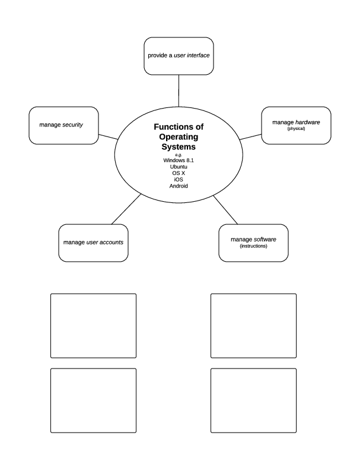

=======================
OS Functions
=======================

* OS stands for *operating system*

* The OS is like all the administrators and directors at a school or the executives at a business

*In the boxes below the diagram, write the names of the operating systems you have used.*
