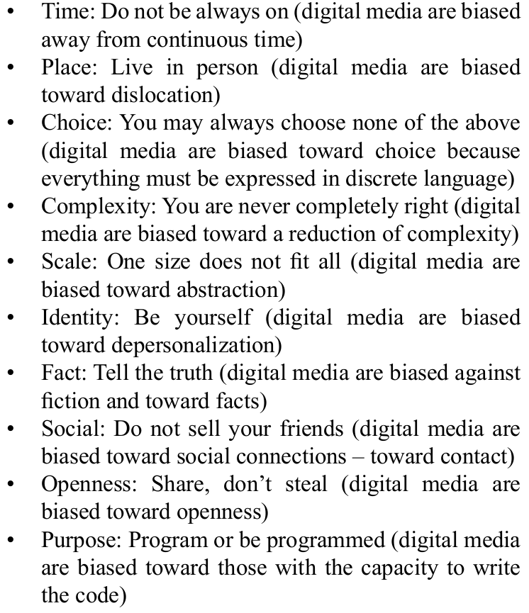

=========================
Lesson Notes
=========================

Scope and sequence

Why Program?
===============

Materials:
-----------

Rushkoff and Rushkoff study guide

Code.org and stem organizaitons for career opportunities

This summary:

Coming to Terms
==================

Discussion: What is a computer?
--------------------------------

* HW
* SW: instructions to carried out by the hardware (especially the processor and the output)
* Input
* Output
* Processing
* [user]

There are two categories of software:

1. Application software: helps the user do something (solves a problem for the user)

2. System software: [prompt to infer]. Helps the computer do something.

What is programming?
-----------------------

* Rely on brainpop

* Programming is finding a solution to a problem or set of related problems. It's the art and science of making a recipe, or **algorithm**, that defines instructions to be carried out by a computer (that's the definition of **software** - a set of instructions to be carried out by a computer). Successful coders find innovative ways to address problems. (Keep *hacker* in mind.)

How is a **program** different from a **script**? And does it matter?
------------------------------------------------------------------------

1. Not a productive discussion.

2. Wikpedia distinguishes for when it must be an issue:

    "**Scripts**" are distinct from the core code of the application, which is usually written in a different language, and are often created or at least modified by the end-user.

    Scripts are often interpreted from source code or bytecode, whereas the applications they control are traditionally compiled to native machine code.

    ----------------------

    The **program** has an executable form that the computer can use directly to execute the instructions.

    The same program in its human-readable source code form, from which executable programs are derived (e.g., compiled)

Coding?
---------------------------

* The act of writing **code**, whether it's a program or script, if we can even distinguish.

* Writing a script or program in a specific programming language:

  A programming language is a special language that programmers use to develop **applications**, **scripts**, or other software for computers to execute.

  [We'll come back to this]

* Coding is also expressed as "hacking" which is more general. "Hacking at a project" suggests working on some form of the development process.

* A career coder is called a *developer* or *software engineer*.

What is a computer language?
---------------------------------

* "A programming language is a special language that programmers use to develop **applications**, **scripts**, or other software for computers to execute."

* Spectrum of low level to high level: refer to brainpop on binary

* There are **compiled** languages and **interpreted** languages.

... a compiler?
-------------------

.. image:: _static/COMPILE.gif

* Break this down:

  [A compiler is a] program that translates source code into object code.

  The compiler derives its name from the way it works, looking at the entire piece of source code and collecting and reorganizing the instructions.

  Thus, a compiler differs from an interpreter, which analyzes and executes each line of source code in succession, without looking at the entire program.

  The advantage of interpreters is that they can execute a program immediately.

  Compilers require some time before an executable program emerges. However, programs produced by compilers run much faster than the same programs executed by an interpreter.

  Every high-level programming language (except strictly interpretive languages) comes with a compiler. In effect, the compiler is the language, because it defines which instructions are acceptable.

  Because compilers translate source code into object code, which is unique for each type of computer, many compilers are available for the same language.

  For example, there is a FORTRAN compiler for PCs and another for Apple Macintosh computers.

  In addition, the compiler industry is quite competitive, so there are actually many compilers for each language on each type of computer. More than a dozen companies develop and sell compilers for the PC.

...an interpreter?
-------------------------

* Code is an input that's read.

* In computer science, an interpreter is a computer program that directly executes, i.e. performs, instructions written in a programming or scripting language, without previously compiling them into a machine language program. An interpreter generally uses one of the following strategies for program execution:

  * parse the source code and perform its behavior directly

  * translate source code into some efficient intermediate representation and immediately execute this

  * explicitly execute stored precompiled code[1] made by a compiler which is part of the interpreter system

What about Java?
------------------

* Intro Java:

  Java is an object-oriented language similar to C++, but simplified to eliminate language features that cause common programming errors. Java source code files (files with a .java extension) are compiled into a format called bytecode (files with a .class extension), which can then be executed by a Java *interpreter*. *Compiled* Java code can run on most computers because Java *interpreters* and runtime environments, known as Java Virtual Machines (VMs), exist for most operating systems, including UNIX, the Macintosh OS, and Windows. Bytecode can also be converted directly into machine language instructions by a just-in-time *compiler* (JIT).

  Java is a general purpose programming language with a number of features that make the language well suited for use on the World Wide Web. Small Java applications are called Java applets and can be downloaded from a Web server and run on your computer by a Java-compatible Web browser, such as Netscape Navigator or Microsoft Internet Explorer.

* Activity: Is it Interpreted or compiled?

  Googled answer, result at top of result page:

    Java is a compiled programming language, but rather than compile straight to executable machine code, it compiles to an intermediate binary form called JVM byte code. The byte code is then compiled and/or interpreted to run the program.

What does low level mean?
--------------------------

"In computer science, a low-level programming language is a programming language that provides little or no abstraction from a computer's instruction set architecture—commands or functions in the language map closely to processor instructions. Generally this refers to either machine code or assembly language."

1. Brainpop on binary

2. Example from COBOL (this program outputs Hello World!)::

    000100 IDENTIFICATION DIVISION.
    000200 PROGRAM-ID.     HELLOWORLD.
    000300
    000400*
    000500 ENVIRONMENT DIVISION.
    000600 CONFIGURATION SECTION.
    000700 SOURCE-COMPUTER. RM-COBOL.
    000800 OBJECT-COMPUTER. RM-COBOL.
    000900
    001000 DATA DIVISION.
    001100 FILE SECTION.
    001200
    100000 PROCEDURE DIVISION.
    100100
    100200 MAIN-LOGIC SECTION.
    100300 BEGIN.
    100400     DISPLAY " " LINE 1 POSITION 1 ERASE EOS.
    100500     DISPLAY "Hello world!" LINE 15 POSITION 10.
    100600     STOP RUN.
    100700 MAIN-LOGIC-EXIT.
    100800     EXIT.

What does high level mean?
----------------------------

"A programming language such as C, FORTRAN, or Pascal that enables a programmer to write programs that are more or less independent of a particular type of computer. Such languages are considered high-level because they are closer to human languages and further from machine languages."

Closer to English. Here's JavaScript wrapped in the language of the web::

  

What does code look like?
----------------------------

Provide interpreted, high level simple code. Perhaps a python bit.

Use guessing game code from *Pyhton for Kids* (No Starch)

1. Remind names of punctuation

2. Identify plain english: how is it separated from code? (on comments)

3. How much makes sense already? Identify familiar words (remark on high level languages and natural language)

2. http://www.anatomyofcode.com/ (JavaScript anatomy); http://www-rohan.sdsu.edu/~gawron/python_for_ss/course_core/book_draft/anatomy/anatomy_introduction.html (Python anatomy)

What did you learn?
--------------------

Coding, hacking on code, program, script, compiler, interpreter, low and high level languages, what code can look like
